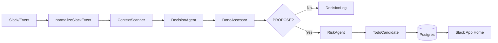
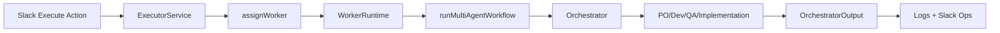

# rapportax

조직 신호에서 숨은 업무 의무를 찾아 사람이 판단할 TODO 후보를 제안하는 멀티 에이전트 워크플로를 개발합니다.

## 프로젝트 요약
- 목적: 회의록, PR 코멘트, Slack 대화 등에서 암시된 업무 의무를 탐지해 TODO 후보로 제안
- 원칙: Human-in-the-loop, 자동 생성 금지, 판단 로그 불변
- 범위: Slack 기반 입력/출력 + 후보 생성 + 실행 트리거 + 멀티 에이전트 실행까지 E2E 연결

## B2B Pain Point
- 암시된 업무가 기록되지 않아 누락 위험이 커지는 문제
- TODO 관리 도구(Jira/Linear)가 다루지 않는 "안 적혔지만 해야 할 일"의 공백
- 책임 추적이 어려운 상황에서 결정 로그와 책임/리스크 근거를 남길 필요

## 패키지
- `packages/obligation-bot`: Slack 기반 의무 탐지 봇

## 아키텍처 개요
```
Input Sources
  -> Event Normalizer
  -> Obligation Pipeline (ContextScanner/Decision/Done/Risk)
  -> TODO Candidate (PROPOSED)
  -> Human Decision (Execute/Hold/Ignore)
  -> Worker Runtime
  -> Multi-Agent Workflow (Orchestrator + PO/Dev/QA/Implementation)
```

## E2E 흐름 (코드 기준)
1) Slack 이벤트 수신 및 컨텍스트 정규화  
   - Slack Socket Mode 이벤트를 수신하고 `ContextObject`로 정규화합니다.  
   - `packages/obligation-bot/src/slack/socket-app.ts`  
   - `packages/obligation-bot/src/normalize/slack.ts`

2) 암시적 의무 탐지 파이프라인  
   - ContextScanner/Decision/Done/Risk 에이전트로 신호 추출 및 제안 여부 판단  
   - PROPOSE면 후보를 생성하고 DB에 저장  
   - `packages/obligation-bot/src/pipeline.ts`  
   - `packages/obligation-bot/src/agents/openai.ts`

3) 후보 노출 및 사람 결정  
   - Slack App Home에 후보 리스트와 Execute/Hold/Ignore 액션 제공  
   - `packages/obligation-bot/src/slack/app-home.ts`  
   - `packages/obligation-bot/src/slack/socket-app.ts`

4) 실행 요청 및 워커 할당  
   - Execute 시 워커를 할당하고 실행 서비스로 전달  
   - `packages/obligation-bot/src/executor/service.ts`  
   - `packages/obligation-bot/src/triage/worker-assignment.ts`

5) 멀티 에이전트 워크플로 실행  
   - Orchestrator가 PO/Dev/QA/Implementation 에이전트를 도구/핸드오프로 호출  
   - `packages/obligation-bot/src/worker/workflow.ts`  
   - `packages/obligation-bot/src/worker/agents.ts`

6) 모니터링 및 로그  
   - 에이전트 이벤트를 JSONL 및 Slack Ops로 기록  
   - `packages/obligation-bot/src/worker/monitor/agent-hooks.ts`  
   - `packages/obligation-bot/src/slack/monitor.ts`

## 멀티 에이전트 사용 방식
- Orchestrator가 단일 진입점이며 필요한 에이전트를 tool/handoff로 호출
- 에이전트 출력은 스키마 기반 JSON으로 표준화
- 코드 변경 및 테스트 제안까지 포함해 실행 가능한 결정으로 합성
- `packages/obligation-bot/src/worker/agents.ts`  
- `packages/obligation-bot/src/worker/workflow.ts`

## 다이어그램
의무 탐지 파이프라인


실행 워크플로


## 코드 지도
- 서비스/파이프라인: `packages/obligation-bot/src/service.ts`, `packages/obligation-bot/src/pipeline.ts`
- 에이전트(단일): `packages/obligation-bot/src/agents/openai.ts`
- 워커/오케스트레이션: `packages/obligation-bot/src/worker/workflow.ts`
- Slack 입출력: `packages/obligation-bot/src/slack/socket-app.ts`, `packages/obligation-bot/src/slack/app-home.ts`
- 저장소: `packages/obligation-bot/src/storage/postgres.ts`

자세한 설계 규칙은 `AGENTS.md`를 참고하세요.
