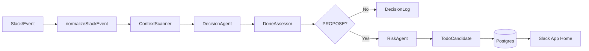
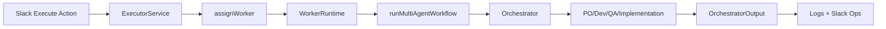

# rapportax

조직 신호에서 숨은 업무 의무를 찾아 사람이 판단할 TODO 후보를 제안하는 멀티 에이전트 워크플로를 개발합니다.

## 프로젝트 요약
- 목적: 회의록, PR 코멘트, Slack 대화 등에서 암시된 업무 의무를 탐지해 TODO 후보로 제안
- 원칙: Human-in-the-loop, 자동 생성 금지, 판단 로그 불변
- 범위: Slack 기반 입력/출력 + 후보 생성 + 실행 트리거 + 멀티 에이전트 실행까지 E2E 연결

## OpenAI 사용 범위 (핵심 기능)
- 암시적 의무 탐지: ContextScanner/Decision/Done/Risk 에이전트가 LLM 기반으로 신호·판단·리스크를 산출
- 실행 워크플로: Orchestrator가 PO/Dev/QA/Implementation 에이전트를 tool/handoff로 호출해 실행 가능한 결정을 합성
- 구현 근거: `packages/obligation-bot/src/agents/openai.ts`, `packages/obligation-bot/src/worker/agents.ts`, `packages/obligation-bot/src/worker/workflow.ts`

## B2B Pain Point
- 암시된 업무가 기록되지 않아 누락 위험이 커지는 문제
- TODO 관리 도구(Jira/Linear)가 다루지 않는 "안 적혔지만 해야 할 일"의 공백
- 책임 추적이 어려운 상황에서 결정 로그와 책임/리스크 근거를 남길 필요

## B2B 시나리오 & ROI 가설
- 시나리오: 회의/PR/Slack에서 합의된 조치가 기록되지 않아 누락되는 업무를 자동 탐지해 제안
- 효용: 누락 감소, 재작업 감소, 책임 추적성 강화, 이슈 재발 방지로 운영 비용 절감
- 도입 범위: 팀 단위 운영(슬랙 앱 홈 + 실행 버튼)으로 빠른 온보딩 가능

## 패키지
- `packages/obligation-bot`: Slack 기반 의무 탐지 봇

## 로컬 실행
1) 의존성 설치
```
pnpm install
```

2) PostgreSQL 실행 (스키마 포함)
```
docker compose up -d
```

3) 환경 변수 설정
```
cp packages/obligation-bot/.env.example packages/obligation-bot/.env
```
`packages/obligation-bot/.env`에 Slack/OpenAI/DB 값을 입력합니다.

4) Slack Socket Mode 실행
```
pnpm -C packages/obligation-bot dev
```

## 환경 변수
필수
- `SLACK_SIGNING_SECRET`
- `SLACK_BOT_TOKEN`
- `SLACK_APP_TOKEN`
- `DATABASE_URL`

권장
- `OPENAI_API_KEY` (LLM 기반 탐지 + 멀티 에이전트 실행에 필요)
- `OPENAI_MODEL` (기본: gpt-5.2)
- `OPENAI_BASE_URL` (프록시/호환 API 사용 시)

예시는 `packages/obligation-bot/.env.example` 참고.

## 아키텍처 개요
```
Input Sources
  -> Event Normalizer
  -> Obligation Pipeline (ContextScanner/Decision/Done/Risk)
  -> TODO Candidate (PROPOSED)
  -> Human Decision (Execute/Hold/Ignore)
  -> Worker Runtime
  -> Multi-Agent Workflow (Orchestrator + PO/Dev/QA/Implementation)
```

## E2E 흐름 (코드 기준)
1) Slack 이벤트 수신 및 컨텍스트 정규화  
   - Slack Socket Mode 이벤트를 수신하고 `ContextObject`로 정규화합니다.  
   - `packages/obligation-bot/src/slack/socket-app.ts`  
   - `packages/obligation-bot/src/normalize/slack.ts`

2) 암시적 의무 탐지 파이프라인  
   - ContextScanner/Decision/Done/Risk 에이전트로 신호 추출 및 제안 여부 판단  
   - PROPOSE면 후보를 생성하고 DB에 저장  
   - `packages/obligation-bot/src/pipeline.ts`  
   - `packages/obligation-bot/src/agents/openai.ts`

3) 후보 노출 및 사람 결정  
   - Slack App Home에 후보 리스트와 Execute/Hold/Ignore 액션 제공  
   - `packages/obligation-bot/src/slack/app-home.ts`  
   - `packages/obligation-bot/src/slack/socket-app.ts`

4) 실행 요청 및 워커 할당  
   - Execute 시 워커를 할당하고 실행 서비스로 전달  
   - `packages/obligation-bot/src/executor/service.ts`  
   - `packages/obligation-bot/src/triage/worker-assignment.ts`

5) 멀티 에이전트 워크플로 실행  
   - Orchestrator가 PO/Dev/QA/Implementation 에이전트를 도구/핸드오프로 호출  
   - `packages/obligation-bot/src/worker/workflow.ts`  
   - `packages/obligation-bot/src/worker/agents.ts`

6) 모니터링 및 로그  
   - 에이전트 이벤트를 JSONL 및 Slack Ops로 기록  
   - `packages/obligation-bot/src/worker/monitor/agent-hooks.ts`  
   - `packages/obligation-bot/src/slack/monitor.ts`

## 멀티 에이전트 사용 방식
- Orchestrator가 단일 진입점이며 필요한 에이전트를 tool/handoff로 호출
- 에이전트 출력은 스키마 기반 JSON으로 표준화
- 코드 변경 및 테스트 제안까지 포함해 실행 가능한 결정으로 합성
- `packages/obligation-bot/src/worker/agents.ts`  
- `packages/obligation-bot/src/worker/workflow.ts`

## 멀티 에이전트 협업 안정성
- 협업 구조: Orchestrator가 PO/Dev/QA/Implementation 결과를 통합해 최종 결정을 생성
- 스키마 검증: 각 에이전트 출력은 JSON 스키마로 파싱하며 실패 시 재요약 경로를 수행
- 도구 호출: repo 도구를 제한적으로 제공해 근거 기반 응답을 유도
- 실행 근거: `packages/obligation-bot/src/worker/workflow.ts`, `packages/obligation-bot/src/worker/schemas.ts`, `packages/obligation-bot/src/worker/tools.ts`

## 안정성/실용성 고려
- 예상치 못한 입력: Slack 이벤트 정규화 및 기본값 처리로 파이프라인 중단을 방지
- 응답 안정성: 에이전트 응답 파싱 실패 시 Orchestrator 재요약 경로로 보정
- 비용/지연 고려: 모델/턴 수를 환경 변수로 제어 가능
- 실행 근거: `packages/obligation-bot/src/normalize/slack.ts`, `packages/obligation-bot/src/worker/workflow.ts`, `packages/obligation-bot/src/di.ts`

## Observability
- 에이전트 실행 로그를 JSONL로 기록하고 Slack Ops 채널에 전송
- 요청 단위 trace 형태로 이벤트를 묶어 모니터링
- 실행 근거: `packages/obligation-bot/src/worker/monitor/agent-hooks.ts`, `packages/obligation-bot/src/slack/monitor.ts`

## Safety / Guardrails
- 개인정보 최소화 원칙을 워크플로 입력 제약으로 강제
- 자동 생성 금지 및 사람 승인 절차 준수
- 실행 근거: `packages/obligation-bot/src/workers/runtime.ts`, `AGENTS.md`

## RAG / 검색 전략 (현재 범위)
- MVP 단계에서는 로컬 이벤트/리포지토리 컨텍스트 중심
- 향후 필요 시 청킹/인덱싱/RAG로 확장 예정

## 다이어그램
의무 탐지 파이프라인


실행 워크플로


## 코드 지도
- 서비스/파이프라인: `packages/obligation-bot/src/service.ts`, `packages/obligation-bot/src/pipeline.ts`
- 에이전트(단일): `packages/obligation-bot/src/agents/openai.ts`
- 워커/오케스트레이션: `packages/obligation-bot/src/worker/workflow.ts`
- Slack 입출력: `packages/obligation-bot/src/slack/socket-app.ts`, `packages/obligation-bot/src/slack/app-home.ts`
- 저장소: `packages/obligation-bot/src/storage/postgres.ts`

자세한 설계 규칙은 `AGENTS.md`를 참고하세요.


## live demo
https://drive.google.com/file/d/1oobsTnRGdbkLSxOVfmFgjmSu6c_jX3mi/view?usp=sharing
